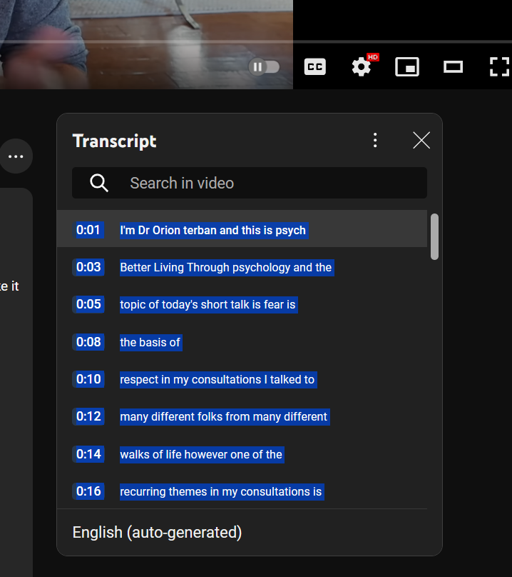
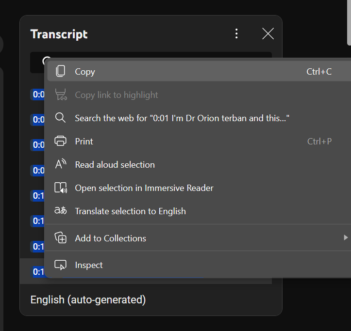
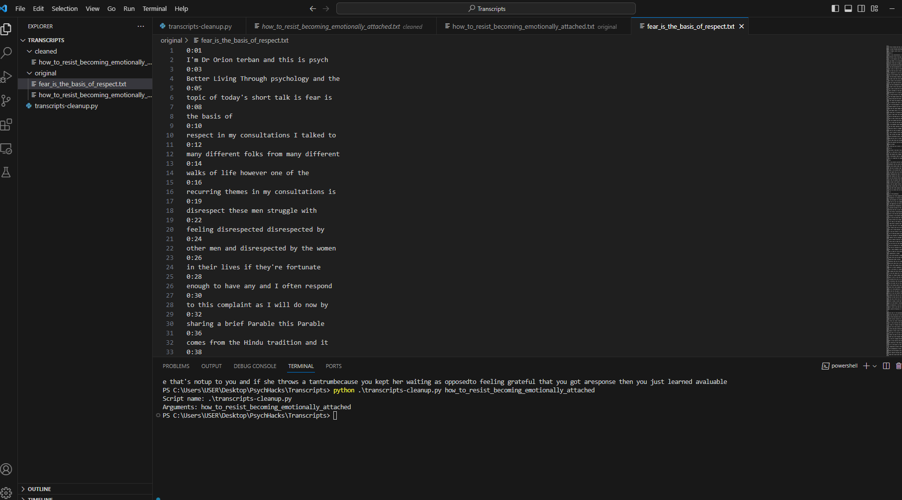
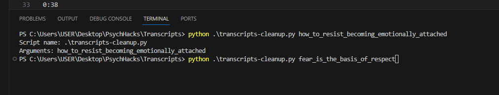
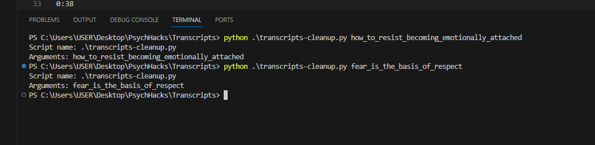
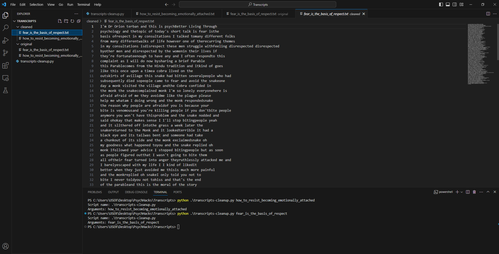

# youtube-transcript-cleanup-script
A Python script for cleaning up YouTube transcripts.

## How to Use
- ### Step 1
Copy transcript from YouTube

- ### Step 2
Paste transcript into txt file with appropriate name in the *original* folder

- ### Step 3
Run script in the project's folder

- ### Step 4
Check *cleaned* folder for cleaned transcript

